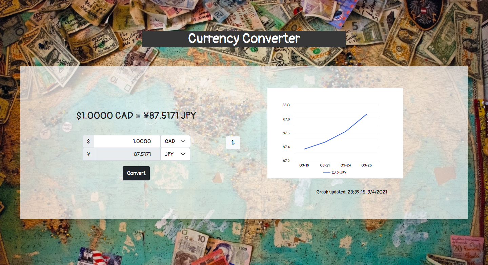

# About
## Currency Converter App

This is a currency converter app which is for portfolio and not for release or monetize.

# Why I created this App
I created this app to practice using fetch API.
Since I stay in Canada, I often use these kind of converters. Then sometimes feel uncomfortable to use it. I just thought if I could make one by myself, I can improve it for my own.

I also tried to make beautiful layout even for mobile friendly. You can enjoy this app both web browsers and mobile devices.

# UI Design

I created UI design with [figma](https://www.figma.com/design/).
On the left side, I put a converter. You can choose countries from the list. Also on the right side, I put graph which show the latest week.

# Languages
- HTML / CSS
- Javascript

I wanted to practice to use fetch in Javascript.

# Upcoming Features
- calculator
- Yearly rate graph
- The latest weekly graph(reflects fetch data)

# References
[Free API](https://free.currencyconverterapi.com/)

